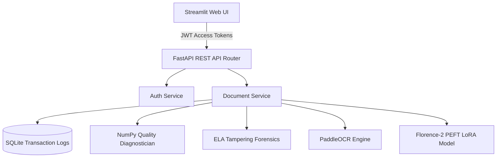
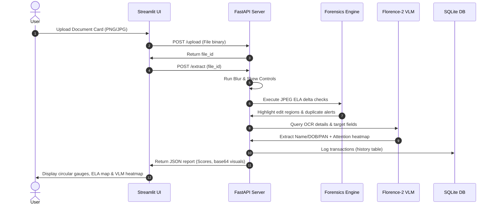

# DocVision AI
> **Intelligent Document Understanding & Identity Verification System**

DocVision AI is a production-ready, portfolio-grade AI research and software engineering workspace designed for processing, classifying, and validating visual documents (scans, receipts, forms, and identity cards) using Vision-Language Models (VLM), OCR, and advanced digital forgery forensics.

---

## System Architecture



---

## Verification & Analysis Flow



---

## Core Features

- **Advanced Computer Vision Forensics**:
  - **Error Level Analysis (ELA)**: Computes pixel deviations from JPEG compression mismatches to highlight localized copy-pastes, text alterations, or photo swaps.
  - **Difference Hashing (dHash)**: Evaluates 64-bit structural hashes to identify and block duplicate document uploads.
  - **Laplacian Blur variance Check**: Implements a native NumPy Laplacian filter to screen defocus blur without binary runtime dependencies.
- **Explainable AI (XAI)**:
  - Generates cross-attention overlays mapping where the VLM encoder-decoder network focused attention during entity extraction.
- **Production FastAPI Backend**:
  - Encapsulates database tables (`users`, `history`, `files`) using SQLite.
  - Secures endpoints using HS256 JWT Bearer Authentication and salted password hashes.
  - Standardized Open API documentation console available under `/docs`.
- **Premium Multi-page Dashboard**:
  - Modular sidebar navigation routing pages: Analytics, Upload panel, Bounding boxes mapping, Field values, VLM QA chats, ELA forensics side-by-side, Quality checks, and SQLite transaction logs tables.
  - Incorporates dynamic SVG progress gauges.
- **Robust Model Training Framework**:
  - Supports PEFT LoRA (Low-Rank Adaptation) fine-tuning of the Florence-2 model on FUNSD, CORD, SROIE, and DocVQA datasets.
  - Optimizations: Mixed Precision FP16, Gradient Accumulation, and Early Stopping.

---

## Code Module Map

```
DocVision-AI/
│
├── api/
│   └── app.py                  <-- FastAPI routers, security guards & routes schemas
├── backend/
│   ├── services/
│   │   ├── auth_service.py     <-- PBKDF2 password encryption & JWT validation
│   │   └── document_service.py <-- Transaction pipeline coordinating model tasks
│   ├── database.py             <-- SQLite table initiations & history transaction loggers
│   ├── document_understanding.py<-- Heuristics classifier & VLM QA
│   ├── ocr_engine.py            <-- PaddleOCR & PyTesseract OCR handlers
│   ├── preprocessor.py          <-- Albumentations document bounding boxes preprocessor
│   ├── verification_service.py  <-- Laplacian blur, ELA maps, dHash, & attention maps
│   └── loaders/                 <-- Loaders factory parsing FUNSD, CORD, SROIE, DocVQA
├── evaluation/
│   └── evaluator.py            <-- Performance perturbation benchmarks (Clean/Blur/Noise/FGSM)
├── frontend/
│   └── app.py                  <-- Streamlit sidebar portal pages & SVG dials
└── tests/
    ├── test_api_backend.py     <-- Test client endpoints & token authentication
    ├── test_evaluator.py       <-- Test perturbation matrices
    ├── test_verification.py     <-- Test blur variance, ELA, and dHash
    ├── test_document_understanding.py <-- Test classification & regex parse rules
    └── test_dl_pipeline.py     <-- Test datasets collators and tokens mapping
```

---

## Quick Start

### 1. Build and Run Local Server
```bash
# 1. Activate venv
python -m venv venv
source venv/bin/activate  # venv\Scripts\activate on Windows

# 2. Install dependencies
pip install -r requirements.txt

# 3. Startup API Backend
uvicorn api.app:app --host 0.0.0.0 --port 8000

# 4. Startup Streamlit Frontend Dashboard
streamlit run frontend/app.py
```

### 2. Run containerized deployment
```bash
docker-compose up --build
```

### 3. Run Automated Tests
```bash
python -m unittest discover -s tests
```

---

## Documentation Reference Index

- 📦 [Installation Guide](docs/INSTALLATION.md)
- 🔌 [API Reference Specifications](docs/API.md)
- 🚀 [PEFT LoRA Fine-Tuning Guide](docs/TRAINING.md)
- 📊 [Datasets Format Guide](docs/DATASETS.md)
- 🕵️ [Docker Container Deployment Guide](docker/DEPLOYMENT.md)

---

## 📄 License & Contributions

DocVision AI is licensed under the [MIT License](LICENSE). Contributions follow the procedures in [CONTRIBUTING.md](CONTRIBUTING.md).
